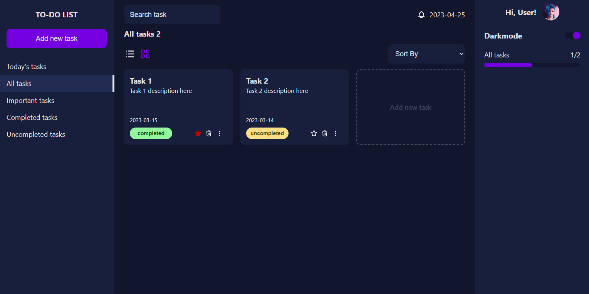
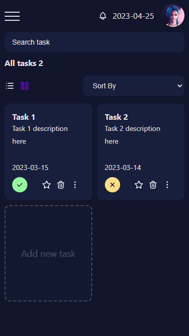

# TO-DO React Application

## Overview

This application is a task organicer made using React, Redux, React-routing-dom, crude css and more.



You can test this application by clicking [this link](https://aonik10.github.io/todo-app/)

## Description

* You can organice tasks by completed, by importants or by date.
* Every task can be created, edited or deleted.
* The view of the tasks can be setted by Grid or List.
* The tasks can be sorted, filtered or searched using the elements around the page.
* User can switch between dark and light mode.
* The application has fully responsive support.



## Objective

The main objective of this application was to practice react, redux and styling in general.

## Frameworks used

1.- React JS\
2.- Redux Toolkit\
3.- React router DOM\
4.- CSS (crude)

## Running locally

You can clone this repository in order to run this app locally.

```bash
git clone https://github.com/Aonik10/todo-app.git
cd todo-app
npm install
npm start
```